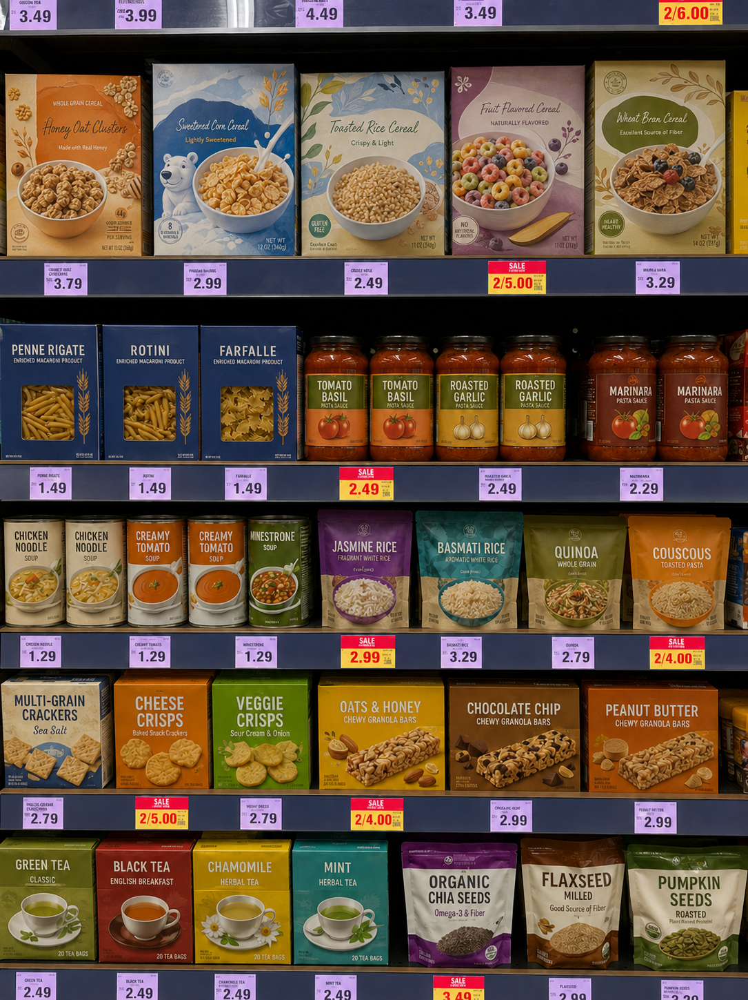
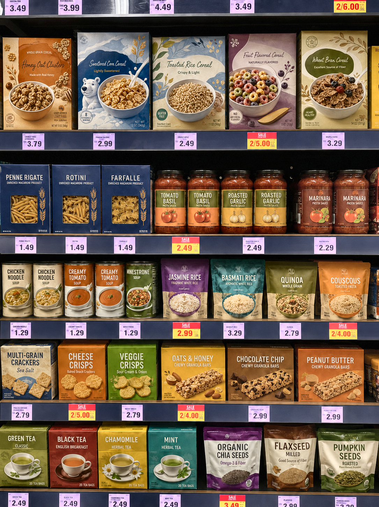
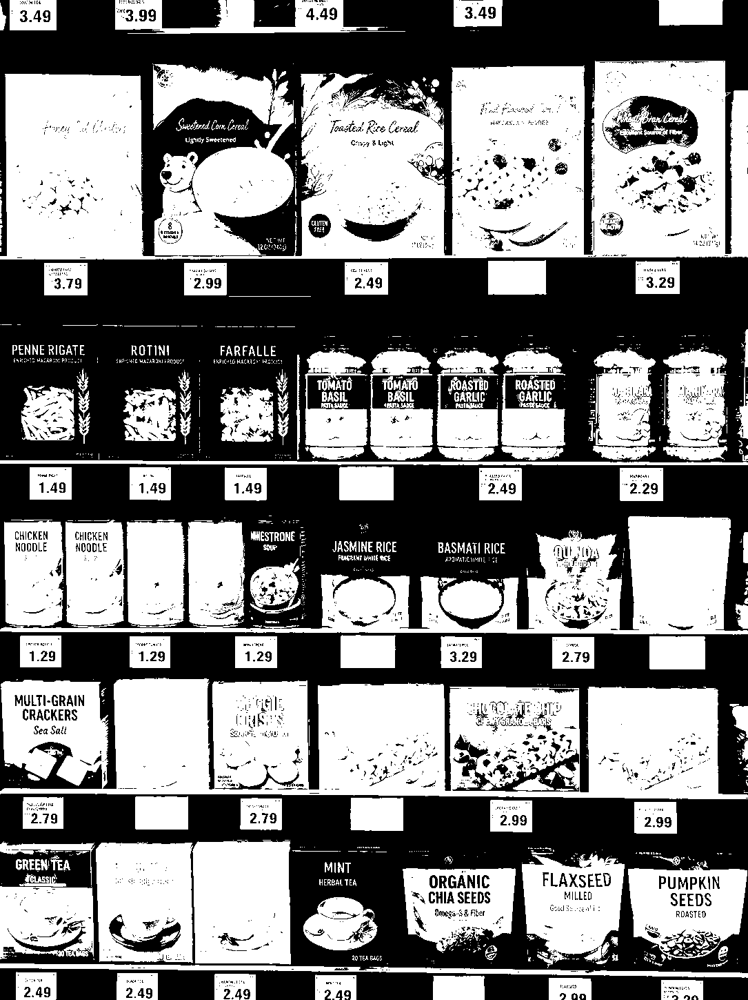
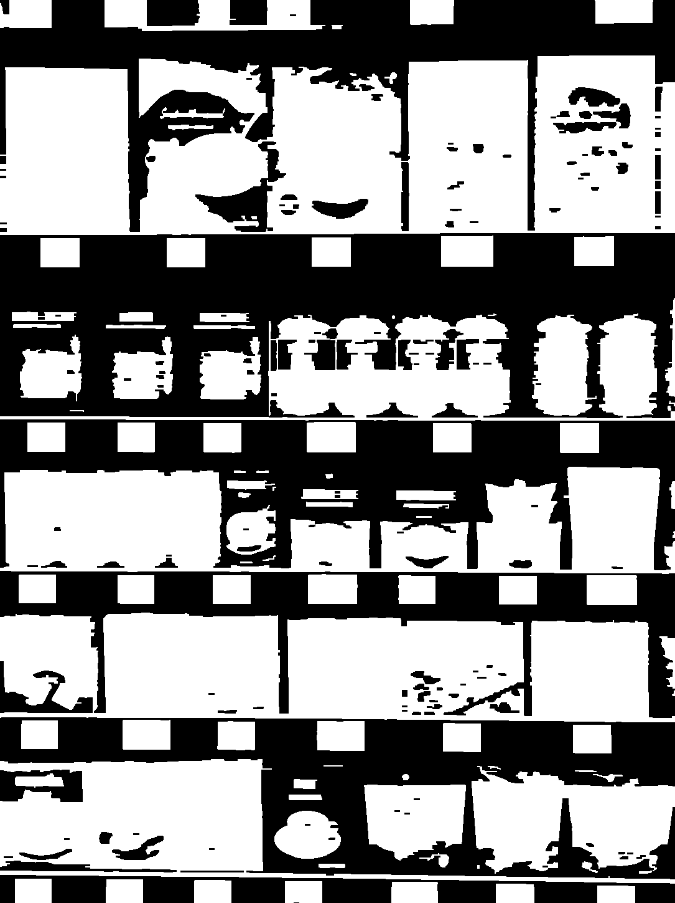
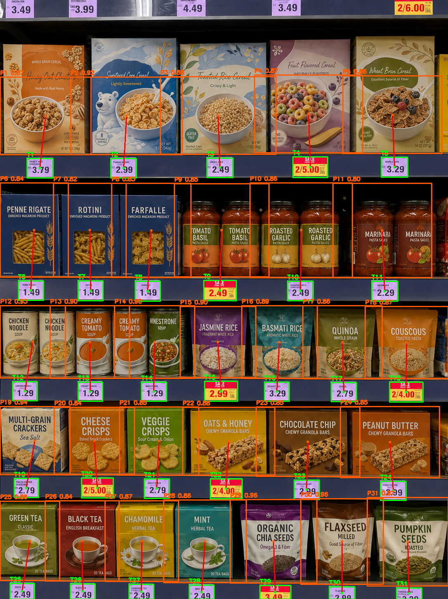

# Price Tag Detection + Product Association

Computer Vision Final Project

**Theme:** Price Tag Detection + Association  
**Task:** Detect price labels and match them to nearby products  
**Team:** team  
**Author:** Mikita Malafei

## Project Goal

The goal of this project is to build a working Computer Vision system that detects supermarket price tags and associates them with nearby products.

The system follows the required course pipeline:

```text
image -> enhance -> segment -> clean -> detect -> decision
```

The final output is an interpretable result showing detected price tags, associated product regions, and an automatic decision.

## Repository Structure

```text
.
├── README.md
├── CONTRIBUTION.md
├── Price_Tag_Detection_Association_Final.ipynb
├── requirements.txt
├── test_images/
│   ├── StoreShelf1.webp
│   └── StoreShelf4.webp
└── images/
    └── result images exported from the notebook
```

## How To Run

1. Open `Price_Tag_Detection_Association_Final.ipynb` in Google Colab.
2. Run all cells.
3. Upload a supermarket shelf image when prompted.
4. The notebook will display all intermediate stages and save result files into `cv_project_outputs`.

The notebook can also be run locally if the dependencies from `requirements.txt` are installed.

## Pipeline

## 1. Enhance

The enhancement stage improves image quality before segmentation.

Methods used:

- light Gaussian Blur;
- CLAHE contrast enhancement.

Detection still uses a sharp copy of the input image, because price labels contain small text and thin borders.

## 2. Segment

The segmentation stage extracts candidate price-label pixels in HSV color space.

Detected label colors:

- red sale strips;
- yellow price regions;
- white or light label paper.

The notebook also includes an adaptive fallback for bright images where the white mask becomes too large.

## 3. Clean

The binary mask is cleaned using classical morphology.

Methods used:

- morphological closing;
- morphological opening;
- connected component filtering.

The result is a cleaner mask containing compact candidate regions.

## 4. Detect

Price tags are detected from the cleaned mask.

The detector checks:

- rectangular shape;
- compact filled mask structure;
- label-like color;
- text-like dark components;
- row alignment;
- similar size between labels in the same row;
- black gaps between neighboring labels.

This helps reject product fragments that may look similar to price labels.

## 5. Decide / Associate

Each detected price tag is matched with a product candidate region above it.

The association logic is based on the shelf layout assumption:

> In supermarket shelf images, the product is usually located above its price label.

The system reports:

- number of detected price tags;
- number of associated product regions;
- weak associations;
- final status.

## Required Outputs

For each test image, the notebook produces:

- original image;
- enhanced image;
- segmentation mask;
- cleaned mask;
- detection result with bounding boxes;
- final association visualization;
- automatic final decision.

After running the notebook, these files are saved in:

```text
cv_project_outputs/
```

## Example Results

After running the notebook, copy the generated images from `cv_project_outputs` into the `images` folder if you want them to appear directly in GitHub.

Recommended image names:

```text
Images/01_original.png
Images/02_enhanced.png
Images/03_segmentation_mask.png
Images/04_clean_mask.png
Images/05_detected_price_tags.png
Images/06_association_result.png
```

Then this section can display them:

### Original Image



### Enhanced Image



### Segmentation Mask



### Clean Mask



### Detection Result


### Final Association Result



## Demo Video

The demo video is available here:

[Watch demo video]https://drive.google.com/file/d/1D8q9ddNQuYSumWfka-lcZ2onRrRovK09/view?usp=drive_link

## Technologies

- Python
- OpenCV
- NumPy
- Pandas
- Matplotlib
- Google Colab

## Limitations

The system works best on frontal or near-frontal supermarket shelf images.

Detection quality may decrease when:

- the photo has strong perspective distortion;
- labels are heavily blurred;
- labels are occluded;
- price labels have unusual colors;
- product packaging looks very similar to price labels.

These limitations are expected for a classical Computer Vision pipeline without deep learning.

## Conclusion

This project implements a complete classical Computer Vision system for price tag detection and product association.

The system runs on real shelf images, produces all required intermediate outputs, detects price labels, associates them with nearby products, and generates an automatic final decision.

